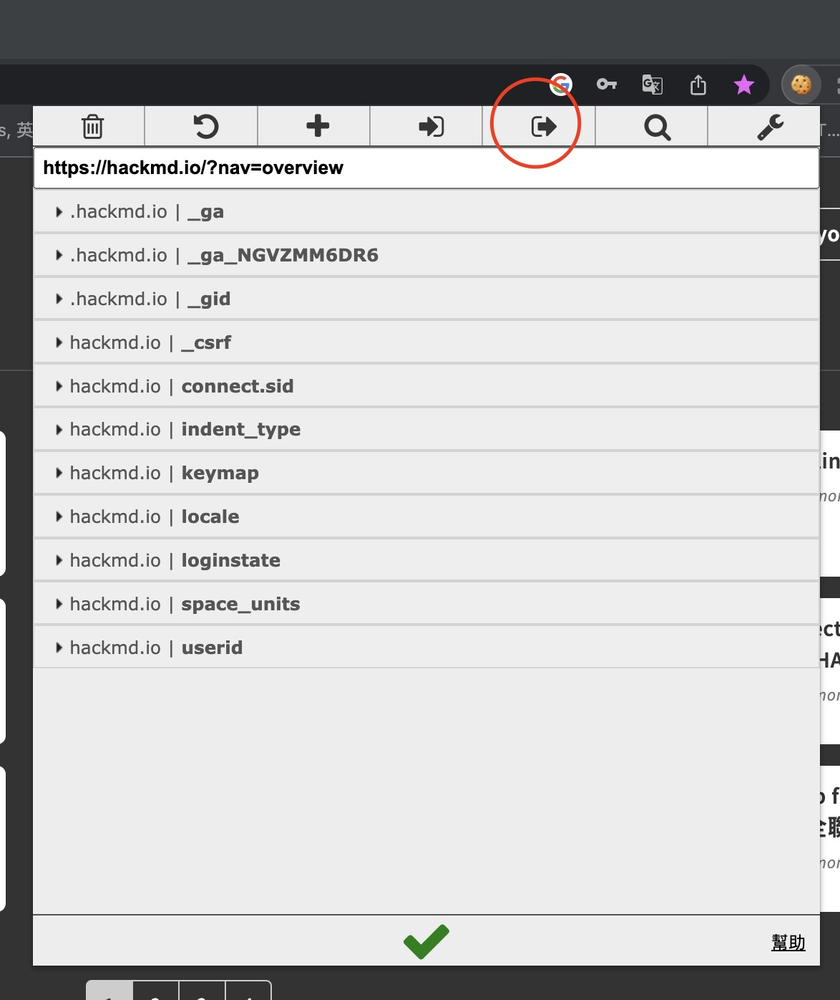

# HACKMD-IMG-DOWNLOADER

## Intro

+ Use python request to download you img on hackmd workspace
+ remember to install `request` module on python
## Steps

0. Create your token from hackmd, and put your token in `download_hackmd_img.py`

[Create tutorial](https://hackmd.io/@hackmd-api/developer-portal/https%3A%2F%2Fhackmd.io%2F%40hackmd-api%2Fhow-to-issue-an-api-token?utm_source=settings-api&utm_medium=inline-cta)

1. Create a directory with the following downloaded images, put your token in script, write down your download url list in `hackmd_image_urls.txt`

```
$ mkdir downloaded_images
```


2. Use [EditThisCookie](https://chrome.google.com/webstore/detail/editthiscookie/fngmhnnpilhplaeedifhccceomclgfbg?hl=zh-TW) plugin on "chrome browser"


3. After install plugin, go to hackmd and login


4. click cookie icon, and click "export cookies", this step would copy the cookies to your clipboard



5. Create a file to record your cookies 

```
$ touch cookies.json
```


6. run your python code!

```
$ python download_hackmd_img.py
```
